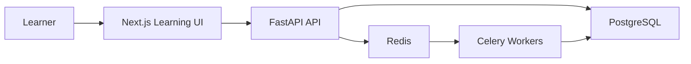
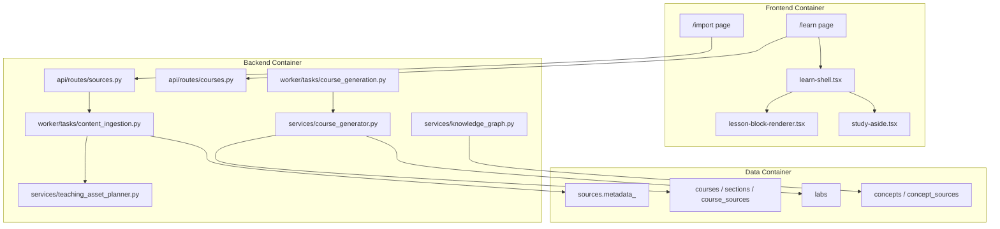
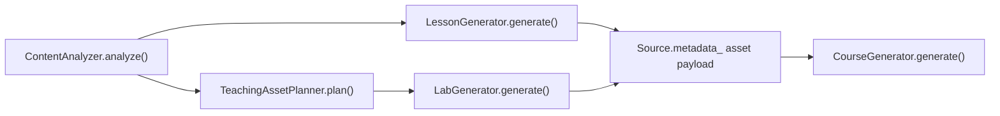
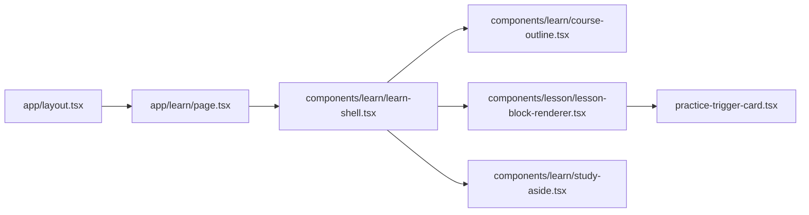
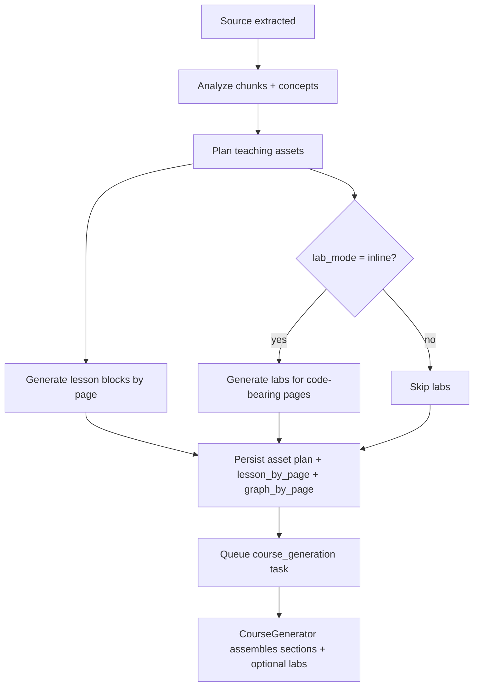
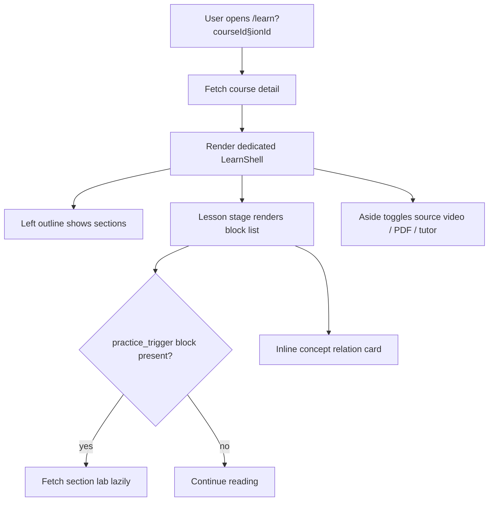
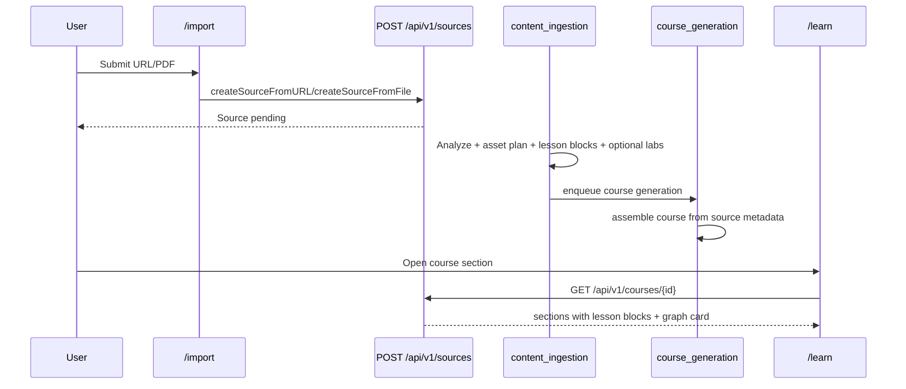

# Course Learning Experience Implementation Plan

> **For agentic workers:** REQUIRED SUB-SKILL: Use superpowers:subagent-driven-development (recommended) or superpowers:executing-plans to implement this plan task-by-task. Steps use checkbox (`- [ ]`) syntax for tracking.

**Goal:** Ship a learning-first course experience that replaces the current tabbed `/learn` page with a dedicated study shell, block-based lesson rendering, inline adaptive labs, and a two-layer graph experience while hiding the dead import-time learning-goal control.

**Architecture:** Generate lesson blocks, asset plans, and inline graph data exactly once during source processing, persist them in source metadata and section content, and simplify course generation to pure course assembly. On the frontend, remove `/learn` from the global sidebar shell and render a dedicated course reader composed of outline, lesson stage, and collapsible study aids.

**Tech Stack:** FastAPI, SQLAlchemy async ORM, Celery, Pydantic v2, Next.js App Router, React, TypeScript, Tailwind CSS, Vitest, pytest

**Spec:** `docs/superpowers/specs/2026-04-19-course-learning-experience-design.md`

---

## Implementation Scheme

### Product Scope

This plan implements the v1 learning-experience rewrite, not a full course-authoring platform.

Included:

- Dedicated `/learn` shell without the global sidebar
- Block-based lesson content with intro / prose / concept / recap rhythm
- Inline Lab generation only for coding-appropriate sources
- Inline graph card plus improved full-course graph payload
- Hidden learning-goal UI on `/import`
- Consolidated backend pipeline so lesson/lab planning happens once

Explicitly deferred:

- Translation `500` bugfix
- Dashboard / path / materials redesign
- Full course editor
- Personalized pathing beyond the current course order
- New template engines or JSP

### Delivery Strategy

Implement in five slices, from backend truth to frontend experience:

1. Introduce structured lesson-block and asset-plan schemas.
2. Consolidate source processing so course assets are generated once and re-used.
3. Improve graph payloads and section content contracts.
4. Replace the `/learn` shell and lesson renderer.
5. Hide dead goal UI and wire the new runtime end-to-end.

This ordering keeps the frontend simple because it consumes already-planned course assets instead of inferring pedagogy at render time.

### Architecture Guardrails

These rules keep the scope focused and prevent regressions:

- `LessonGenerator` and `LabGenerator` run only in source processing; `course_generation` assembles persisted assets and must not re-generate them.
- `/learn` owns its shell; global app chrome must not leak into the learning surface.
- `LessonRenderer` becomes a block renderer with a legacy section-to-block adapter so older courses still render.
- `Lab` is optional. If the asset plan says `lab_mode = none`, the UI shows nothing instead of an empty Lab state.
- Full graph and inline graph share the same conceptual vocabulary, but only the inline graph is required for the main reading flow.

## Architecture Views

### C4-Like Context View



### C4-Like Container View



### C4-Like Backend Component View



### C4-Like Frontend Component View



### Domain Model View

```mermaid
erDiagram
    SOURCE ||--o{ COURSE_SOURCE : feeds
    COURSE ||--o{ COURSE_SOURCE : references
    COURSE ||--o{ SECTION : contains
    SECTION ||--o| LAB : may_embed

    SOURCE {
        uuid id
        string type
        jsonb metadata_
    }

    SECTION {
        uuid id
        uuid source_id
        jsonb content
    }

    LAB {
        uuid id
        uuid section_id
        string language
        jsonb starter_code
    }
```



## Flow Diagrams

### Source Processing To Course Assembly



### Learn Page Runtime Flow



### Sequence Diagram: Import To Learn



## File Structure

### Backend Files

- Create: `backend/app/models/lesson_blocks.py`
  - Typed block schemas and teaching asset plan schemas.
- Create: `backend/app/services/teaching_asset_planner.py`
  - Course-type inference, lab enablement, and block/graph planning fallback rules.
- Modify: `backend/app/models/lesson.py`
  - Extend `LessonContent` to support block-based output while keeping legacy `sections`.
- Modify: `backend/app/services/lesson_generator.py`
  - Generate or backfill lesson blocks.
- Modify: `backend/app/worker/tasks/content_ingestion.py`
  - Run planner, persist `asset_plan`, `lesson_by_page`, `graph_by_page`, and optional `labs_by_page`.
- Modify: `backend/app/services/course_generator.py`
  - Assemble sections from stored metadata, writing block content and graph cards into `Section.content`.
- Modify: `backend/app/worker/tasks/course_generation.py`
  - Stop duplicate lesson/lab generation; delegate to `CourseGenerator`.
- Modify: `backend/app/services/knowledge_graph.py`
  - Enrich full graph payload with section and explanation metadata.
- Test: `backend/tests/test_lesson_generator.py`
- Test: `backend/tests/test_teaching_asset_planner.py`
- Test: `backend/tests/test_content_ingestion.py`
- Test: `backend/tests/test_knowledge_graph.py`
- Test: `backend/tests/test_source_tasks.py`
- Test: `backend/tests/test_smoke.py`

### Frontend Files

- Create: `frontend/src/components/learn/learn-shell.tsx`
  - Dedicated learning shell layout.
- Create: `frontend/src/components/learn/course-outline.tsx`
  - Section list and progress rail.
- Create: `frontend/src/components/learn/study-aside.tsx`
  - Collapsible source/tutor/reference panel.
- Create: `frontend/src/components/lesson/lesson-block-renderer.tsx`
  - Block renderer with legacy adapter.
- Create: `frontend/src/components/lesson/blocks/concept-relation-card.tsx`
  - Inline graph explainer card.
- Create: `frontend/src/components/lesson/blocks/practice-trigger-card.tsx`
  - Inline lab trigger / expander.
- Modify: `frontend/src/app/layout.tsx`
  - Hide global shell on `/learn`.
- Modify: `frontend/src/app/learn/page.tsx`
  - Replace tabbed page with dedicated shell.
- Modify: `frontend/src/components/lesson/lesson-renderer.tsx`
  - Convert into a thin compatibility wrapper around the new block renderer.
- Modify: `frontend/src/components/lab/lab-editor.tsx`
  - Support inline embedded usage without owning the whole page.
- Modify: `frontend/src/app/import/page.tsx`
  - Remove learning-goal requirement and UI.
- Modify: `frontend/src/lib/api.ts`
  - Add lesson-block and graph-card types used by `/learn`.
- Test: `frontend/src/__tests__/learn-page-shell.test.tsx`
- Test: `frontend/src/__tests__/lesson-block-renderer.test.tsx`
- Test: `frontend/src/__tests__/smoke.test.tsx`

## Task 1: Introduce Lesson Blocks And Teaching Asset Planning

**Files:**
- Create: `backend/app/models/lesson_blocks.py`
- Create: `backend/app/services/teaching_asset_planner.py`
- Modify: `backend/app/models/lesson.py`
- Modify: `backend/app/services/lesson_generator.py`
- Test: `backend/tests/test_lesson_generator.py`
- Test: `backend/tests/test_teaching_asset_planner.py`

- [ ] **Step 1: Write the failing backend tests**

```python
# backend/tests/test_teaching_asset_planner.py
import pytest

from app.services.teaching_asset_planner import TeachingAssetPlanner


@pytest.mark.asyncio
async def test_planner_disables_lab_for_non_coding_material():
    planner = TeachingAssetPlanner()

    plan = await planner.plan(
        source_title="Attention Is All You Need 解读",
        source_type="bilibili",
        overall_summary="这是一节解释 Transformer 论文核心思想的课程，没有代码演示。",
        chunk_topics=["self-attention", "encoder-decoder", "multi-head attention"],
        has_code=False,
    )

    assert plan.lab_mode == "none"
    assert plan.graph_mode == "inline_and_overview"


@pytest.mark.asyncio
async def test_planner_enables_inline_lab_for_coding_course():
    planner = TeachingAssetPlanner()

    plan = await planner.plan(
        source_title="Build GPT from scratch",
        source_type="youtube",
        overall_summary="这节课带着学生一步步实现语言模型训练代码。",
        chunk_topics=["tokenizer", "training loop", "backpropagation"],
        has_code=True,
    )

    assert plan.lab_mode == "inline"
```

```python
# backend/tests/test_lesson_generator.py
@pytest.mark.asyncio
async def test_backfills_blocks_from_legacy_sections():
    mock_provider = AsyncMock()
    mock_provider.chat.return_value = LLMResponse(
        content=[ContentBlock(type="text", text=json.dumps({
            "title": "Transformer Intro",
            "summary": "课程概览",
            "sections": [{
                "heading": "Why Attention",
                "content": "Attention replaced recurrence.",
                "timestamp": 0.0,
                "code_snippets": [],
                "key_concepts": ["attention"],
                "diagrams": [],
                "interactive_steps": None,
            }],
        }))],
        model="mock",
    )

    result = await LessonGenerator(mock_provider).generate(
        subtitle_chunks=["attention replaced recurrence"],
        video_title="Transformer Intro",
    )

    assert result.blocks[0].type == "intro_card"
    assert result.blocks[-1].type == "recap"
    assert result.sections[0].heading == "Why Attention"
```

- [ ] **Step 2: Run the targeted tests and verify they fail**

Run: `backend/.venv/bin/python -m pytest backend/tests/test_lesson_generator.py backend/tests/test_teaching_asset_planner.py -q`

Expected:

- `ModuleNotFoundError` for `teaching_asset_planner`
- `AttributeError` or validation failure because `LessonContent` has no `blocks`

- [ ] **Step 3: Implement the block schemas and planner**

```python
# backend/app/models/lesson_blocks.py
from typing import Literal

from pydantic import BaseModel, Field


class ConceptLink(BaseModel):
    label: str
    description: str | None = None


class LessonBlock(BaseModel):
    type: Literal[
        "intro_card",
        "prose",
        "diagram",
        "code_example",
        "concept_relation",
        "practice_trigger",
        "recap",
        "next_step",
    ]
    title: str | None = None
    body: str | None = None
    concepts: list[ConceptLink] = Field(default_factory=list)
    code: str | None = None
    language: str | None = None
    diagram_type: str | None = None
    diagram_content: str | None = None
    metadata: dict[str, str | int | float | bool | None] = Field(default_factory=dict)


class TeachingAssetPlan(BaseModel):
    lab_mode: Literal["inline", "none"] = "none"
    graph_mode: Literal["inline_and_overview", "overview_only"] = "inline_and_overview"
    study_surface: Literal["reader"] = "reader"
```

```python
# backend/app/models/lesson.py
from app.models.lesson_blocks import LessonBlock


class LessonContent(BaseModel):
    title: str
    summary: str
    blocks: list[LessonBlock] = Field(default_factory=list)
    sections: list[LessonSection] = Field(default_factory=list)
```

```python
# backend/app/services/teaching_asset_planner.py
from app.models.lesson_blocks import TeachingAssetPlan


class TeachingAssetPlanner:
    async def plan(
        self,
        *,
        source_title: str,
        source_type: str,
        overall_summary: str,
        chunk_topics: list[str],
        has_code: bool,
    ) -> TeachingAssetPlan:
        coding_markers = {"python", "javascript", "training loop", "api", "tokenizer", "backpropagation"}
        text = " ".join([source_title, overall_summary, *chunk_topics]).lower()
        enable_inline_lab = has_code or any(marker in text for marker in coding_markers)
        return TeachingAssetPlan(
            lab_mode="inline" if enable_inline_lab else "none",
            graph_mode="inline_and_overview",
        )
```

```python
# backend/app/services/lesson_generator.py
from app.models.lesson_blocks import LessonBlock


def _sections_to_blocks(title: str, summary: str, sections: list[LessonSection]) -> list[LessonBlock]:
    blocks: list[LessonBlock] = [LessonBlock(type="intro_card", title=title, body=summary)]
    for section in sections:
        blocks.append(LessonBlock(type="prose", title=section.heading, body=section.content))
        if section.key_concepts:
            blocks.append(
                LessonBlock(
                    type="concept_relation",
                    title=section.heading,
                    concepts=[{"label": concept} for concept in section.key_concepts],
                )
            )
    blocks.append(LessonBlock(type="recap", title="本节小结", body=summary))
    return blocks


data = json.loads(text)
if not data.get("blocks"):
    data["blocks"] = [block.model_dump() for block in _sections_to_blocks(
        data.get("title", video_title),
        data.get("summary", ""),
        [LessonSection(**section) for section in data.get("sections", [])],
    )]
return LessonContent(**data)
```

- [ ] **Step 4: Run the tests again and verify they pass**

Run: `backend/.venv/bin/python -m pytest backend/tests/test_lesson_generator.py backend/tests/test_teaching_asset_planner.py -q`

Expected: `7 passed` or higher, with both new planner tests green.

- [ ] **Step 5: Commit**

```bash
git add backend/app/models/lesson_blocks.py backend/app/services/teaching_asset_planner.py backend/app/models/lesson.py backend/app/services/lesson_generator.py backend/tests/test_lesson_generator.py backend/tests/test_teaching_asset_planner.py
git commit -m "feat: add lesson blocks and teaching asset planning"
```

## Task 2: Consolidate Source Processing And Course Assembly

**Files:**
- Modify: `backend/app/worker/tasks/content_ingestion.py`
- Modify: `backend/app/services/course_generator.py`
- Modify: `backend/app/worker/tasks/course_generation.py`
- Modify: `backend/app/services/source_tasks.py`
- Test: `backend/tests/test_content_ingestion.py`
- Test: `backend/tests/test_source_tasks.py`
- Test: `backend/tests/test_smoke.py`

- [ ] **Step 1: Add failing tests for persisted asset plans and single-generation behavior**

```python
# backend/tests/test_content_ingestion.py
@pytest.mark.asyncio
async def test_ingestion_persists_asset_plan_and_graph_by_page(monkeypatch, db_session, demo_user):
    source = Source(type="youtube", url="https://youtube.com/watch?v=test", status="pending", created_by=demo_user.id)
    db_session.add(source)
    await db_session.flush()

    # Patch analyzer / lesson / planner outputs to deterministic payloads.
    ...

    result = await _ingest_source_async(SimpleNamespace(update_state=lambda **_: None), str(source.id))
    await db_session.refresh(source)

    assert result["status"] == "ready"
    assert source.metadata_["asset_plan"]["graph_mode"] == "inline_and_overview"
    assert "graph_by_page" in source.metadata_
```

```python
# backend/tests/test_smoke.py
@pytest.mark.asyncio
async def test_course_generation_reuses_source_metadata_without_regenerating(client, monkeypatch, db_session, demo_user):
    ...
    monkeypatch.setattr("app.worker.tasks.course_generation.LessonGenerator", lambda *_: (_ for _ in ()).throw(AssertionError("should not run")))
    monkeypatch.setattr("app.worker.tasks.course_generation.LabGenerator", lambda *_: (_ for _ in ()).throw(AssertionError("should not run")))
    ...
    result = generate_course_task.run({"source_id": str(source.id)}, user_id=str(demo_user.id))
    assert result["status"] == "success"
```

- [ ] **Step 2: Run the backend pipeline tests and verify they fail**

Run: `backend/.venv/bin/python -m pytest backend/tests/test_content_ingestion.py backend/tests/test_source_tasks.py backend/tests/test_smoke.py -q`

Expected:

- metadata assertions fail because `asset_plan` and `graph_by_page` do not exist
- smoke test fails because `course_generation` still instantiates `LessonGenerator` / `LabGenerator`

- [ ] **Step 3: Persist asset plans in ingestion and reuse them in course assembly**

```python
# backend/app/worker/tasks/content_ingestion.py
from app.services.teaching_asset_planner import TeachingAssetPlanner

planner = TeachingAssetPlanner()
asset_plan = await planner.plan(
    source_title=source.title or "Untitled",
    source_type=source.type,
    overall_summary=analysis.overall_summary,
    chunk_topics=[chunk.topic for chunk in analysis.chunks],
    has_code=any(chunk.has_code for chunk in analysis.chunks),
)

graph_by_page = {}
for page_idx, lesson_content in lesson_by_page.items():
    key_concepts = []
    for section in lesson_content.sections:
        key_concepts.extend(section.key_concepts)
    graph_by_page[page_idx] = {
        "current": key_concepts[:2],
        "prerequisites": analysis.suggested_prerequisites[:3],
        "unlocks": key_concepts[2:5],
        "section_anchor": page_idx,
    }

labs_by_page = {}
if asset_plan.lab_mode == "inline":
    ...

source.metadata_ = {
    **source.metadata_,
    "asset_plan": asset_plan.model_dump(),
    "lesson_by_page": {str(page_idx): lesson.model_dump() for page_idx, lesson in lesson_by_page.items()},
    "graph_by_page": {str(page_idx): graph for page_idx, graph in graph_by_page.items()},
    "labs_by_page": {str(page_idx): lab for page_idx, lab in labs_by_page.items() if lab is not None},
}
```

```python
# backend/app/services/course_generator.py
asset_plan = (source.metadata_ or {}).get("asset_plan", {"lab_mode": "none"})
graph_by_page = (source.metadata_ or {}).get("graph_by_page", {})

section_content = {
    "summary": lesson_data.get("summary") or first_meta.get("summary", ""),
    "key_terms": ...,
    "has_code": any((c.metadata_ or {}).get("has_code") for c in group_chunks),
    "lab_mode": asset_plan.get("lab_mode", "none"),
    "graph_card": graph_by_page.get(str(page_idx)),
    **({"lesson": lesson_data} if lesson_data else {}),
}

if asset_plan.get("lab_mode") == "inline":
    lab_data = source_lab_map.get(source_id, {}).get(str(page_idx))
    if lab_data:
        await self._create_lab(db, section.id, lab_data)
```

```python
# backend/app/worker/tasks/course_generation.py
from app.services.course_generator import CourseGenerator

await mark_source_task(
    db,
    source_id=sid,
    task_type="course_generation",
    status="running",
    stage="assembling_course",
)

generator = CourseGenerator(resources.model_router)
course = await generator.generate(
    db=db,
    source_ids=[sid],
    title=source.title,
    user_id=uid,
    skip_ready_check=True,
)
```

- [ ] **Step 4: Re-run the backend pipeline tests**

Run: `backend/.venv/bin/python -m pytest backend/tests/test_content_ingestion.py backend/tests/test_source_tasks.py backend/tests/test_smoke.py -q`

Expected: all selected tests pass, and the smoke assertion proves course generation re-used metadata instead of re-generating lessons/labs.

- [ ] **Step 5: Commit**

```bash
git add backend/app/worker/tasks/content_ingestion.py backend/app/services/course_generator.py backend/app/worker/tasks/course_generation.py backend/app/services/source_tasks.py backend/tests/test_content_ingestion.py backend/tests/test_source_tasks.py backend/tests/test_smoke.py
git commit -m "refactor: reuse planned learning assets during course assembly"
```

## Task 3: Enrich Graph Payloads And Section Content Contracts

**Files:**
- Modify: `backend/app/services/knowledge_graph.py`
- Modify: `backend/app/models/course.py`
- Modify: `backend/app/api/routes/courses.py`
- Test: `backend/tests/test_knowledge_graph.py`
- Test: `backend/tests/test_smoke.py`

- [ ] **Step 1: Write failing tests for richer graph payloads**

```python
# backend/tests/test_knowledge_graph.py
def test_graph_node_keeps_section_and_description_fields():
    node = KnowledgeGraphNode(
        id="1",
        label="Attention",
        category="concept",
        mastery=0.5,
        section_id="section-1",
        description="Explains how tokens attend to each other.",
        kind="current",
    )

    dumped = node.model_dump()
    assert dumped["description"] == "Explains how tokens attend to each other."
    assert dumped["kind"] == "current"
```

```python
# backend/tests/test_smoke.py
@pytest.mark.asyncio
async def test_get_course_returns_section_graph_card(client, db_session, demo_user):
    ...
    section.content = {
        "lesson": {"title": "X", "summary": "", "blocks": [], "sections": []},
        "graph_card": {"current": ["attention"], "prerequisites": ["embedding"], "unlocks": ["decoder"]},
        "lab_mode": "none",
    }
    ...
    res = await client.get(f"/api/v1/courses/{course.id}")
    assert res.json()["sections"][0]["content"]["graph_card"]["current"] == ["attention"]
```

- [ ] **Step 2: Run the graph and course contract tests**

Run: `backend/.venv/bin/python -m pytest backend/tests/test_knowledge_graph.py backend/tests/test_smoke.py -q`

Expected:

- node model test fails because `description` and `kind` are not defined
- smoke test fails if course serialization strips the richer `content` payload

- [ ] **Step 3: Implement richer graph node contracts**

```python
# backend/app/services/knowledge_graph.py
class KnowledgeGraphNode(BaseModel):
    id: str
    label: str
    category: str | None = None
    mastery: float = 0.0
    section_id: str | None = None
    description: str | None = None
    kind: str = "related"


nodes.append(
    KnowledgeGraphNode(
        id=str(concept.id),
        label=concept.name,
        category=concept.category,
        mastery=round(mastery, 2),
        description=concept.description,
        kind="current" if concept.name in section_focus else "related",
    )
)
```

```python
# backend/app/models/course.py
class SectionResponse(BaseModel):
    ...
    content: dict[str, Any] = Field(default_factory=dict)
```

```python
# backend/app/api/routes/courses.py
SectionResponse(
    id=s.id,
    title=s.title,
    ...
    content=s.content or {},
)
```

- [ ] **Step 4: Re-run the graph contract tests**

Run: `backend/.venv/bin/python -m pytest backend/tests/test_knowledge_graph.py backend/tests/test_smoke.py -q`

Expected: all selected tests pass, and `/api/v1/courses/{id}` preserves `graph_card` and `lab_mode` in section content.

- [ ] **Step 5: Commit**

```bash
git add backend/app/services/knowledge_graph.py backend/app/models/course.py backend/app/api/routes/courses.py backend/tests/test_knowledge_graph.py backend/tests/test_smoke.py
git commit -m "feat: expose learning graph context in course payloads"
```

## Task 4: Replace The `/learn` Shell And Remove Global Sidebar Leakage

**Files:**
- Create: `frontend/src/components/learn/learn-shell.tsx`
- Create: `frontend/src/components/learn/course-outline.tsx`
- Create: `frontend/src/components/learn/study-aside.tsx`
- Modify: `frontend/src/app/layout.tsx`
- Modify: `frontend/src/app/learn/page.tsx`
- Test: `frontend/src/__tests__/learn-page-shell.test.tsx`
- Test: `frontend/src/__tests__/smoke.test.tsx`

- [ ] **Step 1: Add failing frontend tests for the dedicated learning shell**

```tsx
// frontend/src/__tests__/learn-page-shell.test.tsx
it("hides the global sidebar on /learn and renders the dedicated study shell", async () => {
  vi.doMock("next/navigation", () => ({
    useRouter: () => ({ push: vi.fn(), back: vi.fn() }),
    useSearchParams: () => new URLSearchParams("courseId=c1&sectionId=s1"),
    usePathname: () => "/learn",
  }));

  globalThis.fetch = mockFetch({
    "/api/v1/courses/c1": {
      id: "c1",
      title: "Transformer 课程",
      description: "desc",
      created_at: "2026-01-01T00:00:00Z",
      updated_at: "2026-01-01T00:00:00Z",
      sources: [],
      sections: [{
        id: "s1",
        title: "第一节",
        order_index: 0,
        difficulty: 2,
        content: { lesson: { title: "第一节", summary: "summary", blocks: [], sections: [] } },
      }],
    },
  });

  const LearnPage = (await import("@/app/learn/page")).default;
  render(<SuspenseWrapper><LearnPage /></SuspenseWrapper>);

  await waitFor(() => {
    expect(screen.getByText("Transformer 课程")).toBeInTheDocument();
    expect(screen.getByText("课程目录")).toBeInTheDocument();
    expect(screen.queryByText("资料")).not.toBeInTheDocument();
    expect(screen.queryByText("Lab")).not.toBeInTheDocument();
  });
});
```

```tsx
// frontend/src/__tests__/smoke.test.tsx
expect(screen.getByText("课程目录")).toBeInTheDocument();
expect(screen.getByRole("button", { name: "打开学习辅助区" })).toBeInTheDocument();
```

- [ ] **Step 2: Run the frontend learn-shell tests and confirm they fail**

Run: `npm --prefix frontend test -- --run src/__tests__/learn-page-shell.test.tsx src/__tests__/smoke.test.tsx`

Expected:

- existing `/learn` render still shows tabbed UI
- layout still injects the global sidebar on `/learn`

- [ ] **Step 3: Implement the dedicated learn shell and route-level chrome rules**

```tsx
// frontend/src/app/layout.tsx
const HIDE_GLOBAL_SHELL_PREFIXES = ["/login", "/setup", "/learn"];

const hideSidebarEntirely = HIDE_GLOBAL_SHELL_PREFIXES.some((prefix) =>
  pathname === prefix || pathname.startsWith(`${prefix}/`)
);
```

```tsx
// frontend/src/components/learn/learn-shell.tsx
export function LearnShell({
  courseTitle,
  currentIndex,
  totalSections,
  outline,
  lessonStage,
  aside,
}: {
  courseTitle: string;
  currentIndex: number;
  totalSections: number;
  outline: React.ReactNode;
  lessonStage: React.ReactNode;
  aside: React.ReactNode;
}) {
  return (
    <div className="min-h-screen bg-[var(--bg)] text-[var(--text)]">
      <header className="sticky top-0 z-30 border-b border-[var(--border)] bg-[var(--surface)]/95 backdrop-blur">
        <div className="mx-auto flex max-w-[1600px] items-center justify-between px-4 py-3 lg:px-6">
          <div>
            <p className="text-xs text-[var(--text-tertiary)]">课程进行中</p>
            <h1 className="text-base font-semibold">{courseTitle}</h1>
          </div>
          <div className="text-sm text-[var(--text-secondary)]">{currentIndex} / {totalSections}</div>
        </div>
      </header>
      <div className="mx-auto grid max-w-[1600px] gap-4 px-4 py-4 lg:grid-cols-[260px_minmax(0,1fr)_360px] lg:px-6">
        {outline}
        {lessonStage}
        {aside}
      </div>
    </div>
  );
}
```

```tsx
// frontend/src/app/learn/page.tsx
return (
  <LearnShell
    courseTitle={course.title}
    currentIndex={currentSectionIndex + 1}
    totalSections={course.sections.length}
    outline={<CourseOutline ... />}
    lessonStage={<section className="min-w-0">{learnContent}</section>}
    aside={<StudyAside ... />}
  />
);
```

- [ ] **Step 4: Run the frontend tests again**

Run: `npm --prefix frontend test -- --run src/__tests__/learn-page-shell.test.tsx src/__tests__/smoke.test.tsx`

Expected: targeted tests pass and confirm the old tabbed chrome is gone.

- [ ] **Step 5: Commit**

```bash
git add frontend/src/app/layout.tsx frontend/src/app/learn/page.tsx frontend/src/components/learn/learn-shell.tsx frontend/src/components/learn/course-outline.tsx frontend/src/components/learn/study-aside.tsx frontend/src/__tests__/learn-page-shell.test.tsx frontend/src/__tests__/smoke.test.tsx
git commit -m "feat: replace learn tabs with dedicated study shell"
```

## Task 5: Render Lesson Blocks, Inline Labs, And Hide Dead Import Goals

**Files:**
- Create: `frontend/src/components/lesson/lesson-block-renderer.tsx`
- Create: `frontend/src/components/lesson/blocks/concept-relation-card.tsx`
- Create: `frontend/src/components/lesson/blocks/practice-trigger-card.tsx`
- Modify: `frontend/src/components/lesson/lesson-renderer.tsx`
- Modify: `frontend/src/components/lab/lab-editor.tsx`
- Modify: `frontend/src/app/import/page.tsx`
- Modify: `frontend/src/lib/api.ts`
- Test: `frontend/src/__tests__/lesson-block-renderer.test.tsx`
- Test: `frontend/src/__tests__/smoke.test.tsx`

- [ ] **Step 1: Add failing tests for block rendering and import without goal selection**

```tsx
// frontend/src/__tests__/lesson-block-renderer.test.tsx
it("renders intro, prose, concept relation, practice trigger, and recap blocks", async () => {
  const { default: LessonBlockRenderer } = await import("@/components/lesson/lesson-block-renderer");

  render(
    <LessonBlockRenderer
      lesson={{
        title: "Transformer Intro",
        summary: "课程概览",
        blocks: [
          { type: "intro_card", title: "你将学到什么", body: "Attention 的核心思想" },
          { type: "prose", title: "背景", body: "RNN 的瓶颈在于..." },
          { type: "concept_relation", title: "概念关系", concepts: [{ label: "attention" }, { label: "encoder" }] },
          { type: "practice_trigger", title: "动手试一试", body: "实现一个简化 attention scorer", metadata: { sectionId: "s1" } },
          { type: "recap", title: "本节小结", body: "Attention 解决了长依赖问题" },
        ],
        sections: [],
      }}
    />
  );

  expect(screen.getByText("你将学到什么")).toBeInTheDocument();
  expect(screen.getByText("动手试一试")).toBeInTheDocument();
});
```

```tsx
// frontend/src/__tests__/smoke.test.tsx
it("allows import submission without choosing a learning goal", async () => {
  const fetchMock = vi.fn().mockResolvedValue({
    ok: true,
    json: () => Promise.resolve({ id: "src1", type: "bilibili", status: "pending", task_id: "t1" }),
  });
  globalThis.fetch = fetchMock as typeof fetch;

  const ImportPage = (await import("@/app/import/page")).default;
  render(<ImportPage />);

  fireEvent.change(screen.getByPlaceholderText("https://www.bilibili.com/video/BV..."), {
    target: { value: "https://www.bilibili.com/video/BV1xoJwzDESD" },
  });
  fireEvent.click(screen.getByRole("button", { name: "开始导入" }));

  await waitFor(() => expect(fetchMock).toHaveBeenCalledTimes(1));
});
```

- [ ] **Step 2: Run the renderer and import tests**

Run: `npm --prefix frontend test -- --run src/__tests__/lesson-block-renderer.test.tsx src/__tests__/smoke.test.tsx`

Expected:

- `lesson-block-renderer.tsx` does not exist
- import test fails because `canSubmit` still requires `goal`

- [ ] **Step 3: Implement block rendering, inline practice, and import cleanup**

```tsx
// frontend/src/components/lesson/lesson-block-renderer.tsx
import { ConceptRelationCard } from "./blocks/concept-relation-card";
import { PracticeTriggerCard } from "./blocks/practice-trigger-card";

function blocksFromLegacy(lesson: LessonContent): LessonBlock[] {
  if (lesson.blocks?.length) return lesson.blocks;
  return [
    { type: "intro_card", title: lesson.title, body: lesson.summary },
    ...lesson.sections.flatMap((section) => [
      { type: "prose", title: section.heading, body: section.content },
      ...(section.key_concepts.length
        ? [{ type: "concept_relation", title: section.heading, concepts: section.key_concepts.map((label) => ({ label })) }]
        : []),
    ]),
    { type: "recap", title: "本节小结", body: lesson.summary },
  ];
}
```

```tsx
// frontend/src/components/lesson/blocks/practice-trigger-card.tsx
export function PracticeTriggerCard({
  title,
  body,
  sectionId,
  enabled,
}: {
  title: string;
  body: string;
  sectionId: string;
  enabled: boolean;
}) {
  const [open, setOpen] = useState(false);
  const [lab, setLab] = useState<LabResponse | null>(null);

  if (!enabled) return null;

  return (
    <section className="rounded-2xl border border-[var(--border)] bg-[var(--surface)] p-5">
      <div className="flex items-center justify-between gap-3">
        <div>
          <h3 className="text-base font-semibold">{title}</h3>
          <p className="mt-1 text-sm text-[var(--text-secondary)]">{body}</p>
        </div>
        <button onClick={() => setOpen((value) => !value)} className="rounded-full bg-[var(--primary)] px-4 py-2 text-sm text-white">
          {open ? "收起练习" : "开始练习"}
        </button>
      </div>
      {open && lab ? <LabEditor lab={lab} embedded /> : null}
    </section>
  );
}
```

```tsx
// frontend/src/components/lab/lab-editor.tsx
interface LabEditorProps {
  lab: LabResponse;
  embedded?: boolean;
}

<div className={clsx("overflow-hidden", embedded ? "rounded-2xl border border-gray-200 bg-white" : "flex h-full")}>
```

```tsx
// frontend/src/app/import/page.tsx
const canSubmit = Boolean(sourceType === "bilibili" || sourceType === "youtube" ? url.trim() : pdfName);
// remove goal state, goal cards, and any copy that implies the choice drives generation
```

```ts
// frontend/src/lib/api.ts
export interface LessonBlock {
  type: "intro_card" | "prose" | "diagram" | "code_example" | "concept_relation" | "practice_trigger" | "recap" | "next_step";
  title?: string | null;
  body?: string | null;
  concepts?: Array<{ label: string; description?: string | null }>;
  metadata?: Record<string, string | number | boolean | null>;
}
```

- [ ] **Step 4: Run the renderer and import tests again**

Run: `npm --prefix frontend test -- --run src/__tests__/lesson-block-renderer.test.tsx src/__tests__/smoke.test.tsx`

Expected: targeted tests pass, and import no longer requires the removed goal selection.

- [ ] **Step 5: Commit**

```bash
git add frontend/src/components/lesson/lesson-block-renderer.tsx frontend/src/components/lesson/blocks/concept-relation-card.tsx frontend/src/components/lesson/blocks/practice-trigger-card.tsx frontend/src/components/lesson/lesson-renderer.tsx frontend/src/components/lab/lab-editor.tsx frontend/src/app/import/page.tsx frontend/src/lib/api.ts frontend/src/__tests__/lesson-block-renderer.test.tsx frontend/src/__tests__/smoke.test.tsx
git commit -m "feat: add block lesson renderer and inline practice flow"
```

## Final Verification

- [ ] **Step 1: Run backend verification**

Run:

```bash
backend/.venv/bin/python -m pytest backend/tests/test_lesson_generator.py \
  backend/tests/test_teaching_asset_planner.py \
  backend/tests/test_content_ingestion.py \
  backend/tests/test_knowledge_graph.py \
  backend/tests/test_source_tasks.py \
  backend/tests/test_smoke.py -q
```

Expected: all targeted backend tests pass.

- [ ] **Step 2: Run frontend verification**

Run:

```bash
npm --prefix frontend test -- --run src/__tests__/learn-page-shell.test.tsx \
  src/__tests__/lesson-block-renderer.test.tsx \
  src/__tests__/smoke.test.tsx
```

Expected: all targeted frontend tests pass.

- [ ] **Step 3: Run lint checks for touched frontend files**

Run:

```bash
npm --prefix frontend exec eslint -- src/app/layout.tsx \
  src/app/learn/page.tsx \
  src/app/import/page.tsx \
  src/components/learn/learn-shell.tsx \
  src/components/learn/course-outline.tsx \
  src/components/learn/study-aside.tsx \
  src/components/lesson/lesson-renderer.tsx \
  src/components/lesson/lesson-block-renderer.tsx \
  src/components/lesson/blocks/concept-relation-card.tsx \
  src/components/lesson/blocks/practice-trigger-card.tsx \
  src/components/lab/lab-editor.tsx \
  src/lib/api.ts \
  src/__tests__/learn-page-shell.test.tsx \
  src/__tests__/lesson-block-renderer.test.tsx \
  src/__tests__/smoke.test.tsx
```

Expected: eslint exits with status `0`.

- [ ] **Step 4: Manual product verification**

Run through this checklist locally:

1. Import a non-coding video and confirm the resulting course shows no empty Lab placeholder.
2. Import a coding-heavy source and confirm the course shows an inline practice trigger.
3. Open `/learn` in IAB width and confirm no global sidebar overlays the page.
4. Open the study aside and confirm video/PDF remains auxiliary rather than occupying half the page.
5. Confirm `/import` can submit with only a source URL or PDF selected.

## Self-Review

Spec coverage check:

- Dedicated learn shell: covered by Task 4.
- Block-based lesson rendering: covered by Task 1 and Task 5.
- Adaptive Lab generation: covered by Task 1 and Task 2.
- Two-layer graph direction: inline graph card via Task 2 and Task 5, richer full graph payload via Task 3.
- Hidden learning-goal UI: covered by Task 5.
- Necessary backend de-duplication: covered by Task 2.

Placeholder scan:

- No `TODO`, `TBD`, or “similar to above” steps remain.

Type consistency check:

- `TeachingAssetPlan.lab_mode` is consistently `inline | none`.
- `LessonContent.blocks` is introduced before any frontend task consumes it.
- `graph_card` is the section-content key used consistently in backend and frontend tasks.

Execution handoff:

- Recommended execution order is exactly the task order above.
- Do not mix Task 4 and Task 5 before Task 2 lands, or the frontend will target payloads that do not exist yet.
