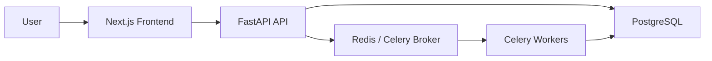
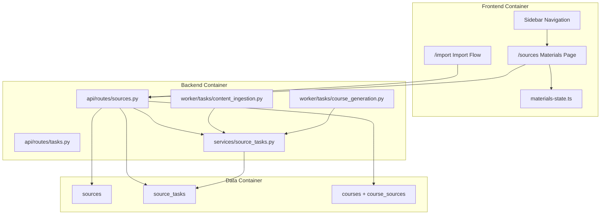
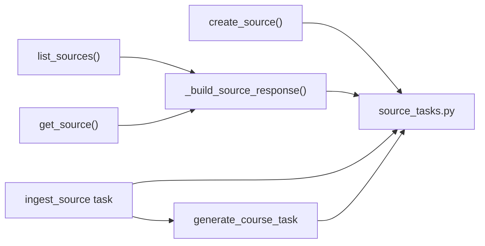
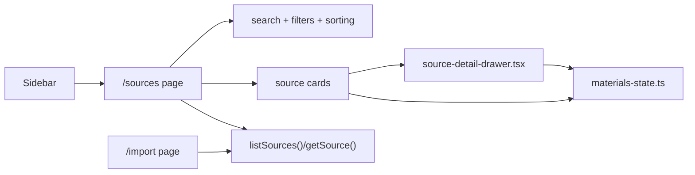
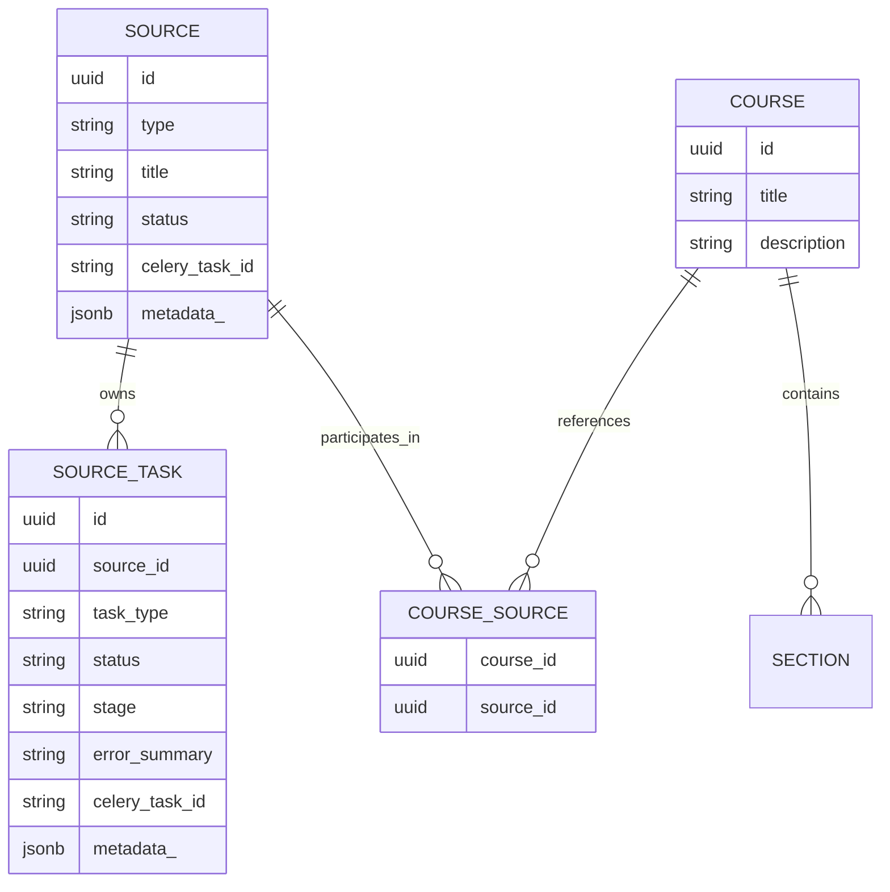
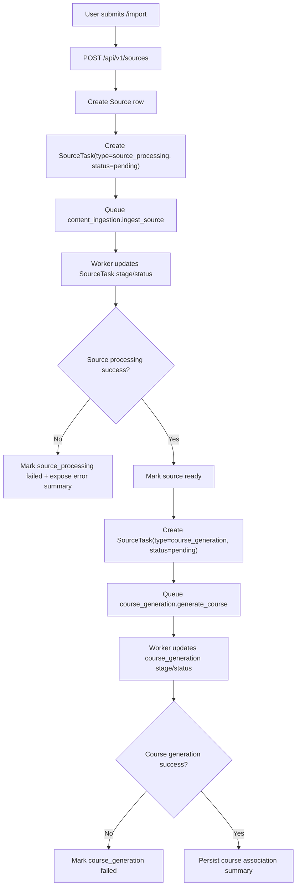
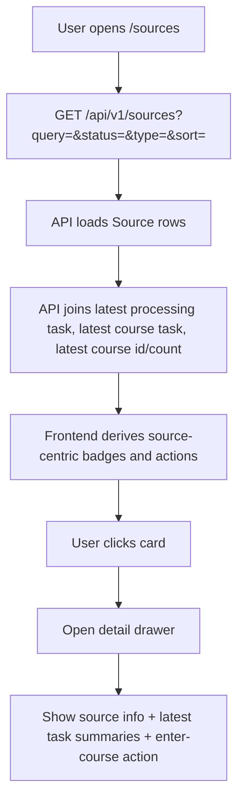
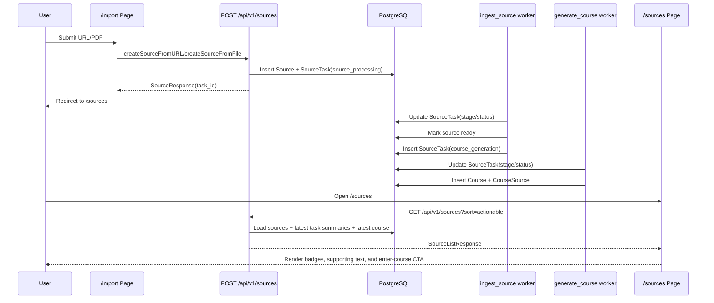

# Materials Management Implementation Plan

> **For agentic workers:** REQUIRED SUB-SKILL: Use superpowers:subagent-driven-development (recommended) or superpowers:executing-plans to implement this plan task-by-task. Steps use checkbox (`- [ ]`) syntax for tracking.

**Goal:** Build a first-version “资料” module that treats sources as first-class assets, persists decoupled task records for source processing and course generation, and gives users a searchable materials page with status summaries and a detail drawer.

**Architecture:** Keep `/import` as the creation flow, but move the product’s main entry point to `/sources` as a materials hub. Introduce a durable `SourceTask` model so the UI reads source-centric summaries from the database instead of inferring everything from raw Celery state. Re-split source processing and course generation into separate task records so materials, tasks, and courses become cleanly decoupled while preserving the default automation chain.

**Tech Stack:** FastAPI, SQLAlchemy async ORM, Alembic, Celery, Pydantic v2, Next.js App Router, React, TypeScript, Vitest, pytest

**Spec:** `docs/superpowers/specs/2026-04-19-materials-management-design.md`

---

## Implementation Scheme

### Product Scope

This implementation ships the first usable materials module, not the full long-term content operations system.

Included in this plan:

- `资料` as a top-level navigation entry
- Materials list page at `/sources`
- Search, status filter, type filter, and actionable/recent sorting
- Source cards with source-centric status summaries
- Right-side detail drawer for source/task/course context
- Durable database task records for source processing and course generation
- Automatic orchestration: source import -> source processing task -> course generation task

Explicitly deferred:

- Multi-source manual course creation
- Standalone task center page
- Batch actions, labels, folders, favorites, archive
- Raw logs viewer
- Delete and retry UI

### Delivery Strategy

Implement in three layers, from backend truth to frontend presentation:

1. Add durable source-task persistence and worker orchestration.
2. Expose source-centric API summaries with filtering/sorting.
3. Rebuild the frontend around a materials-first page and detail drawer.

This order keeps the frontend simple because it consumes stable summaries instead of reconstructing task state client-side.

### Architecture Guardrails

These rules constrain the implementation so the v1 module does not regress back into “import history”:

- `Source` remains the user-visible asset and page primary key.
- `SourceTask` becomes the durable runtime record for async work, rather than treating Celery state as the source of truth.
- `Course` stays a downstream product connected through `course_sources`, not through `source.metadata_["course_id"]`.
- User-facing badges and CTAs are derived aggregation states, not raw database or Celery enums.
- `/import` remains the write flow, but a successful submission returns users to `/sources` so the main monitoring experience is source-centric.

## Architecture Views

### C4-Like Context View



### C4-Like Container View



### C4-Like Component View For Materials Backend



### C4-Like Component View For Materials Frontend



### Domain Model View



## Flow Diagrams

### Import And Automatic Orchestration



### Materials Page Read Flow



### Sequence Diagram: Import To Materials Hub



## File Map

### Backend Files

- Create: `backend/app/db/models/source_task.py`
- Create: `backend/app/services/source_tasks.py`
- Create: `backend/alembic/versions/4b7c2f1a9d11_add_source_tasks_table.py`
- Create: `backend/tests/test_source_tasks.py`
- Create: `backend/tests/test_sources_materials.py`
- Modify: `backend/app/db/models/source.py`
- Modify: `backend/app/db/models/__init__.py`
- Modify: `backend/app/models/source.py`
- Modify: `backend/app/api/routes/sources.py`
- Modify: `backend/app/worker/tasks/content_ingestion.py`
- Modify: `backend/app/worker/tasks/course_generation.py`
- Modify: `backend/app/api/routes/tasks.py`

### Frontend Files

- Create: `frontend/src/lib/materials-state.ts`
- Create: `frontend/src/lib/materials-state.test.ts`
- Create: `frontend/src/components/materials/source-detail-drawer.tsx`
- Create: `frontend/src/__tests__/sources-page.test.tsx`
- Modify: `frontend/src/lib/api.ts`
- Modify: `frontend/src/components/sidebar.tsx`
- Modify: `frontend/src/app/sources/page.tsx`
- Modify: `frontend/src/app/import/page.tsx`

## Task 1: Add Durable Source Task Persistence

**Files:**
- Create: `backend/app/db/models/source_task.py`
- Create: `backend/alembic/versions/4b7c2f1a9d11_add_source_tasks_table.py`
- Modify: `backend/app/db/models/source.py`
- Modify: `backend/app/db/models/__init__.py`
- Test: `backend/tests/test_sources_materials.py`

- [ ] **Step 1: Write the failing backend test for persisted processing tasks**

```python
from sqlalchemy import select
from unittest.mock import MagicMock, patch

from app.db.models.source_task import SourceTask


@pytest.mark.asyncio
async def test_create_source_persists_processing_task(client, db_session):
    with patch("app.api.routes.sources.ingest_source") as mock_task:
        mock_result = MagicMock()
        mock_result.id = "fake-task-001"
        mock_task.delay.return_value = mock_result

        res = await client.post("/api/v1/sources", data={
            "url": "https://www.youtube.com/watch?v=kCc8FmEb1nY",
        })

    assert res.status_code == 201
    source_id = uuid.UUID(res.json()["id"])
    tasks = (
        await db_session.execute(
            select(SourceTask).where(SourceTask.source_id == source_id)
        )
    ).scalars().all()

    assert len(tasks) == 1
    assert tasks[0].task_type == "source_processing"
    assert tasks[0].status == "pending"
    assert tasks[0].celery_task_id == "fake-task-001"
```

- [ ] **Step 2: Run the test and verify it fails**

Run: `backend/.venv/bin/python -m pytest backend/tests/test_sources_materials.py::test_create_source_persists_processing_task -v`

Expected: FAIL with `ModuleNotFoundError` for `source_task` or an assertion showing that no persisted task rows exist.

- [ ] **Step 3: Write the minimal persistence model and migration**

```python
# backend/app/db/models/source_task.py
import uuid

from sqlalchemy import ForeignKey, String, Text, text
from sqlalchemy.dialects.postgresql import JSONB, UUID as PG_UUID
from sqlalchemy.orm import Mapped, mapped_column, relationship

from app.db.models.base import Base, BaseMixin


class SourceTask(BaseMixin, Base):
    __tablename__ = "source_tasks"

    source_id: Mapped[uuid.UUID] = mapped_column(
        PG_UUID(as_uuid=True), ForeignKey("sources.id"), nullable=False, index=True
    )
    task_type: Mapped[str] = mapped_column(String(50), nullable=False)
    status: Mapped[str] = mapped_column(
        String(50), nullable=False, server_default=text("'pending'")
    )
    stage: Mapped[str | None] = mapped_column(String(100), nullable=True)
    error_summary: Mapped[str | None] = mapped_column(Text, nullable=True)
    celery_task_id: Mapped[str | None] = mapped_column(String(255), nullable=True, index=True)
    metadata_: Mapped[dict] = mapped_column("metadata_", JSONB, server_default=text("'{}'"))

    source: Mapped["Source"] = relationship("Source", back_populates="tasks")
```

```python
# backend/app/db/models/source.py
tasks: Mapped[list["SourceTask"]] = relationship(
    "SourceTask",
    back_populates="source",
    order_by="desc(SourceTask.created_at)",
)
```

```python
# backend/alembic/versions/4b7c2f1a9d11_add_source_tasks_table.py
def upgrade() -> None:
    op.create_table(
        "source_tasks",
        sa.Column("id", sa.UUID(), primary_key=True),
        sa.Column("source_id", sa.UUID(), sa.ForeignKey("sources.id"), nullable=False),
        sa.Column("task_type", sa.String(length=50), nullable=False),
        sa.Column("status", sa.String(length=50), nullable=False, server_default="pending"),
        sa.Column("stage", sa.String(length=100), nullable=True),
        sa.Column("error_summary", sa.Text(), nullable=True),
        sa.Column("celery_task_id", sa.String(length=255), nullable=True),
        sa.Column("metadata_", postgresql.JSONB(astext_type=sa.Text()), nullable=False, server_default=sa.text("'{}'")),
        sa.Column("created_at", sa.DateTime(), server_default=sa.func.now(), nullable=False),
        sa.Column("updated_at", sa.DateTime(), server_default=sa.func.now(), nullable=False),
    )
    op.create_index("ix_source_tasks_source_id", "source_tasks", ["source_id"])
    op.create_index("ix_source_tasks_celery_task_id", "source_tasks", ["celery_task_id"])
```

- [ ] **Step 4: Run the test and verify it passes**

Run: `backend/.venv/bin/python -m pytest backend/tests/test_sources_materials.py::test_create_source_persists_processing_task -v`

Expected: PASS with `1 passed`.

- [ ] **Step 5: Commit**

```bash
git add backend/app/db/models/source_task.py backend/alembic/versions/4b7c2f1a9d11_add_source_tasks_table.py backend/app/db/models/source.py backend/app/db/models/__init__.py backend/tests/test_sources_materials.py
git commit -m "feat: persist source task records"
```

## Task 2: Track Source Processing And Course Generation Separately

**Files:**
- Create: `backend/app/services/source_tasks.py`
- Create: `backend/tests/test_source_tasks.py`
- Modify: `backend/app/api/routes/sources.py`
- Modify: `backend/app/worker/tasks/content_ingestion.py`
- Modify: `backend/app/worker/tasks/course_generation.py`
- Test: `backend/tests/test_source_tasks.py`

- [ ] **Step 1: Write the failing orchestration test**

```python
from types import SimpleNamespace


@pytest.mark.asyncio
async def test_finish_source_processing_enqueues_course_generation_task(monkeypatch, db_session, demo_user):
    source = Source(
        type="youtube",
        url="https://www.youtube.com/watch?v=test",
        title="Source Title",
        status="pending",
        created_by=demo_user.id,
    )
    processing_task = SourceTask(
        source_id=source.id,
        task_type="source_processing",
        status="running",
        celery_task_id="processing-1",
    )
    db_session.add_all([source, processing_task])
    await db_session.flush()

    monkeypatch.setattr(
        "app.services.source_tasks.generate_course_task.delay",
        lambda payload, goal=None, user_id=None: SimpleNamespace(id="course-1"),
    )

    result = await finish_source_processing_and_enqueue_course(
        db=db_session,
        source=source,
        processing_task=processing_task,
        payload={"source_id": str(source.id)},
    )

    assert result["queued_course_task_id"] == "course-1"
    course_tasks = (
        await db_session.execute(
            select(SourceTask).where(SourceTask.source_id == source.id)
        )
    ).scalars().all()
    assert {task.task_type for task in course_tasks} == {"source_processing", "course_generation"}
```

- [ ] **Step 2: Run the test and verify it fails**

Run: `backend/.venv/bin/python -m pytest backend/tests/test_source_tasks.py::test_finish_source_processing_enqueues_course_generation_task -v`

Expected: FAIL with `ImportError` for `finish_source_processing_and_enqueue_course` or assertions showing no `course_generation` row.

- [ ] **Step 3: Write the minimal task-tracking service and wire it into workers**

```python
# backend/app/services/source_tasks.py
async def create_source_task(db, *, source_id, task_type, celery_task_id, status="pending", stage=None, metadata=None):
    row = SourceTask(
        source_id=source_id,
        task_type=task_type,
        celery_task_id=celery_task_id,
        status=status,
        stage=stage,
        metadata_=metadata or {},
    )
    db.add(row)
    await db.flush()
    return row


async def mark_source_task(db, *, celery_task_id, status, stage=None, error_summary=None, metadata=None):
    row = (
        await db.execute(
            select(SourceTask).where(SourceTask.celery_task_id == celery_task_id)
        )
    ).scalar_one()
    row.status = status
    row.stage = stage
    row.error_summary = error_summary
    if metadata:
        row.metadata_ = {**(row.metadata_ or {}), **metadata}
    await db.flush()
    return row


async def finish_source_processing_and_enqueue_course(db, *, source, processing_task, payload):
    processing_task.status = "success"
    processing_task.stage = "ready"
    processing_task.metadata_ = {**(processing_task.metadata_ or {}), **payload}
    source.status = "ready"
    await db.flush()

    async_result = generate_course_task.delay(
        payload,
        user_id=str(source.created_by) if source.created_by else None,
    )
    await create_source_task(
        db,
        source_id=source.id,
        task_type="course_generation",
        celery_task_id=async_result.id,
    )
    await db.flush()
    return {"queued_course_task_id": async_result.id}
```

```python
# backend/app/api/routes/sources.py
task = ingest_source.delay(str(source.id))
source.celery_task_id = task.id
await create_source_task(
    db,
    source_id=source.id,
    task_type="source_processing",
    celery_task_id=task.id,
)
```

```python
# backend/app/worker/tasks/content_ingestion.py
await mark_source_task(
    db,
    celery_task_id=task.request.id,
    status="running",
    stage="analyzing",
)
# ...
await finish_source_processing_and_enqueue_course(
    db=db,
    source=source,
    processing_task=task_row,
    payload={"source_id": source_id, "title": source.title},
)
```

```python
# backend/app/worker/tasks/course_generation.py
await mark_source_task(
    db,
    celery_task_id=task.request.id,
    status="running",
    stage="assembling_course",
)
# ...
await mark_source_task(
    db,
    celery_task_id=task.request.id,
    status="success",
    stage="ready",
    metadata={"course_id": str(course.id)},
)
```

- [ ] **Step 4: Run the orchestration tests and verify they pass**

Run: `backend/.venv/bin/python -m pytest backend/tests/test_source_tasks.py -v`

Expected: PASS with all source-task orchestration tests green.

- [ ] **Step 5: Commit**

```bash
git add backend/app/services/source_tasks.py backend/tests/test_source_tasks.py backend/app/api/routes/sources.py backend/app/worker/tasks/content_ingestion.py backend/app/worker/tasks/course_generation.py
git commit -m "feat: split source and course task orchestration"
```

## Task 3: Expose Source-Centric Materials Summaries From The API

**Files:**
- Modify: `backend/app/models/source.py`
- Modify: `backend/app/api/routes/sources.py`
- Modify: `backend/app/api/routes/tasks.py`
- Test: `backend/tests/test_sources_materials.py`

- [ ] **Step 1: Write the failing API summary test**

```python
@pytest.mark.asyncio
async def test_list_sources_returns_task_and_course_summaries(client, db_session, demo_user):
    source = Source(
        type="pdf",
        title="Transformer Notes",
        status="ready",
        created_by=demo_user.id,
        metadata_={"original_filename": "transformer.pdf"},
    )
    db_session.add(source)
    await db_session.flush()

    db_session.add_all([
        SourceTask(source_id=source.id, task_type="source_processing", status="success", stage="ready"),
        SourceTask(source_id=source.id, task_type="course_generation", status="running", stage="assembling_course"),
    ])
    await db_session.flush()

    res = await client.get("/api/v1/sources?status=processing&query=Transformer&sort=actionable")
    assert res.status_code == 200
    item = res.json()["items"][0]
    assert item["latest_processing_task"]["status"] == "success"
    assert item["latest_course_task"]["stage"] == "assembling_course"
    assert item["course_count"] == 0
```

- [ ] **Step 2: Run the test and verify it fails**

Run: `backend/.venv/bin/python -m pytest backend/tests/test_sources_materials.py::test_list_sources_returns_task_and_course_summaries -v`

Expected: FAIL because `latest_processing_task`, `latest_course_task`, or filtering fields are missing.

- [ ] **Step 3: Write the response schemas and source summary builder**

```python
# backend/app/models/source.py
class SourceTaskSummary(BaseModel):
    id: uuid.UUID
    task_type: str
    status: str
    stage: str | None = None
    error_summary: str | None = None
    created_at: datetime
    updated_at: datetime


class SourceResponse(BaseModel):
    id: uuid.UUID
    type: str
    url: str | None = None
    title: str | None = None
    status: str
    metadata_: dict[str, Any] = Field(default_factory=dict, alias="metadata_")
    task_id: str | None = None
    latest_processing_task: SourceTaskSummary | None = None
    latest_course_task: SourceTaskSummary | None = None
    course_count: int = 0
    latest_course_id: uuid.UUID | None = None
    created_at: datetime
    updated_at: datetime
```

```python
# backend/app/api/routes/sources.py
async def _build_source_response(db: AsyncSession, source: Source) -> SourceResponse:
    tasks = (
        await db.execute(
            select(SourceTask)
            .where(SourceTask.source_id == source.id)
            .order_by(SourceTask.created_at.desc())
        )
    ).scalars().all()
    latest_processing = next((task for task in tasks if task.task_type == "source_processing"), None)
    latest_course_task = next((task for task in tasks if task.task_type == "course_generation"), None)
    latest_course_id = (
        await db.execute(
            select(Course.id)
            .join(CourseSource, CourseSource.course_id == Course.id)
            .where(CourseSource.source_id == source.id)
            .order_by(Course.created_at.desc())
            .limit(1)
        )
    ).scalar_one_or_none()

    return SourceResponse(
        id=source.id,
        type=source.type,
        url=source.url,
        title=source.title,
        status=source.status,
        metadata_=source.metadata_,
        task_id=source.celery_task_id,
        latest_processing_task=latest_processing,
        latest_course_task=latest_course_task,
        course_count=1 if latest_course_id else 0,
        latest_course_id=latest_course_id,
        created_at=source.created_at,
        updated_at=source.updated_at,
    )
```

```python
# backend/app/api/routes/sources.py
async def list_sources(..., query: str | None = None, status: str | None = None, source_type: str | None = None, sort: str = "actionable"):
    stmt = select(Source).where(Source.created_by == user.id)
    if query:
        stmt = stmt.where(or_(Source.title.ilike(f"%{query}%"), Source.url.ilike(f"%{query}%")))
    if source_type:
        stmt = stmt.where(Source.type == source_type)
```

- [ ] **Step 4: Run the API tests and verify they pass**

Run: `backend/.venv/bin/python -m pytest backend/tests/test_sources_materials.py -v`

Expected: PASS with list/detail summary coverage green.

- [ ] **Step 5: Commit**

```bash
git add backend/app/models/source.py backend/app/api/routes/sources.py backend/app/api/routes/tasks.py backend/tests/test_sources_materials.py
git commit -m "feat: return source-centric material summaries"
```

## Task 4: Add Frontend Materials Types, State Mapping, And Navigation

**Files:**
- Create: `frontend/src/lib/materials-state.ts`
- Create: `frontend/src/lib/materials-state.test.ts`
- Modify: `frontend/src/lib/api.ts`
- Modify: `frontend/src/components/sidebar.tsx`
- Test: `frontend/src/lib/materials-state.test.ts`

- [ ] **Step 1: Write the failing materials-state test**

```ts
import { describe, expect, it } from "vitest";

import { deriveMaterialPresentation } from "./materials-state";

describe("deriveMaterialPresentation", () => {
  it("surfaces course generation failure while keeping the source usable", () => {
    const result = deriveMaterialPresentation({
      status: "ready",
      latest_processing_task: { task_type: "source_processing", status: "success", stage: "ready" },
      latest_course_task: { task_type: "course_generation", status: "failure", stage: "assembling_course", error_summary: "LLM timeout" },
      latest_course_id: null,
      metadata_: {},
    } as any);

    expect(result.badge).toBe("课程生成失败");
    expect(result.primaryAction).toBe("view-details");
    expect(result.supportingText).toContain("LLM timeout");
  });
});
```

- [ ] **Step 2: Run the test and verify it fails**

Run: `cd frontend && npm test -- --run src/lib/materials-state.test.ts`

Expected: FAIL because `materials-state.ts` does not exist yet.

- [ ] **Step 3: Write the minimal API types and presentation mapper**

```ts
// frontend/src/lib/api.ts
export interface SourceTaskSummary {
  id: string;
  task_type: "source_processing" | "course_generation";
  status: string;
  stage?: string;
  error_summary?: string | null;
  created_at: string;
  updated_at: string;
}

export interface SourceResponse {
  id: string;
  type: string;
  url?: string;
  title?: string;
  status: string;
  metadata_: Record<string, unknown>;
  task_id?: string;
  latest_processing_task?: SourceTaskSummary | null;
  latest_course_task?: SourceTaskSummary | null;
  course_count?: number;
  latest_course_id?: string | null;
  created_at: string;
  updated_at: string;
}
```

```ts
// frontend/src/lib/materials-state.ts
export function deriveMaterialPresentation(source: SourceResponse) {
  if (source.latest_course_task?.status === "failure") {
    return {
      badge: "课程生成失败",
      supportingText: source.latest_course_task.error_summary || "课程任务失败",
      primaryAction: "view-details" as const,
    };
  }

  if (source.latest_course_id) {
    return {
      badge: "已生成课程",
      supportingText: "资料处理完成，可直接进入课程",
      primaryAction: "enter-course" as const,
    };
  }

  if (source.latest_course_task?.status === "running" || source.latest_course_task?.status === "pending") {
    return {
      badge: "课程生成中",
      supportingText: source.latest_course_task.stage || "正在生成课程",
      primaryAction: "view-details" as const,
    };
  }

  return {
    badge: "处理中",
    supportingText: source.latest_processing_task?.stage || "资料处理中",
    primaryAction: "view-details" as const,
  };
}
```

```ts
// frontend/src/components/sidebar.tsx
const items = [
  { id: "/", label: "首页", icon: Home },
  { id: "/sources", label: "资料", icon: Search },
  { id: "/settings", label: "设置", icon: Settings },
];
```

- [ ] **Step 4: Run the frontend mapper tests and verify they pass**

Run: `cd frontend && npm test -- --run src/lib/materials-state.test.ts`

Expected: PASS with `1 passed`.

- [ ] **Step 5: Commit**

```bash
git add frontend/src/lib/api.ts frontend/src/lib/materials-state.ts frontend/src/lib/materials-state.test.ts frontend/src/components/sidebar.tsx
git commit -m "feat: add materials state mapping and navigation"
```

## Task 5: Rebuild `/sources` As The Materials Hub

**Files:**
- Create: `frontend/src/components/materials/source-detail-drawer.tsx`
- Create: `frontend/src/__tests__/sources-page.test.tsx`
- Modify: `frontend/src/app/sources/page.tsx`
- Test: `frontend/src/__tests__/sources-page.test.tsx`

- [ ] **Step 1: Write the failing page test**

```tsx
it("filters materials and opens the detail drawer", async () => {
  globalThis.fetch = mockFetch({
    "/api/v1/sources": {
      items: [
        {
          id: "src-1",
          type: "youtube",
          title: "Karpathy GPT",
          status: "ready",
          metadata_: {},
          latest_processing_task: { task_type: "source_processing", status: "success", stage: "ready" },
          latest_course_task: { task_type: "course_generation", status: "running", stage: "assembling_course" },
          latest_course_id: null,
          created_at: "2026-04-19T00:00:00Z",
          updated_at: "2026-04-19T00:00:00Z",
        },
      ],
      total: 1,
      skip: 0,
      limit: 20,
    },
  });

  const Page = (await import("@/app/sources/page")).default;
  render(<Page />);

  await waitFor(() => {
    expect(screen.getByText("资料")).toBeInTheDocument();
    expect(screen.getByText("Karpathy GPT")).toBeInTheDocument();
  });

  fireEvent.click(screen.getByText("Karpathy GPT"));
  await waitFor(() => {
    expect(screen.getByText("当前状态")).toBeInTheDocument();
    expect(screen.getByText("组装课程")).toBeInTheDocument();
  });
});
```

- [ ] **Step 2: Run the page test and verify it fails**

Run: `cd frontend && npm test -- --run src/__tests__/sources-page.test.tsx`

Expected: FAIL because the current page still renders “导入历史” and has no detail drawer.

- [ ] **Step 3: Write the minimal materials page and drawer**

```tsx
// frontend/src/app/sources/page.tsx
const [query, setQuery] = useState("");
const [statusFilter, setStatusFilter] = useState<"all" | "processing" | "ready" | "failure">("all");
const [selectedSource, setSelectedSource] = useState<SourceResponse | null>(null);

const filtered = sources
  .filter((source) => source.title?.toLowerCase().includes(query.toLowerCase()) || source.url?.toLowerCase().includes(query.toLowerCase()))
  .filter((source) => statusFilter === "all" ? true : deriveMaterialBucket(source) === statusFilter)
  .sort(compareMaterialsActionableFirst);

return (
  <div className="min-h-screen bg-gray-50">
    <div className="max-w-5xl mx-auto px-4 sm:px-6 pt-14 md:pt-6 pb-6">
      <div className="flex items-center justify-between mb-6">
        <div>
          <h1 className="text-xl font-bold text-gray-900">资料</h1>
          <p className="text-sm text-gray-500 mt-1">管理你导入过的学习资料，并查看它们的处理状态和课程产出</p>
        </div>
        <Link href="/import"><Button>导入资料</Button></Link>
      </div>
      {/* search + filters */}
      {/* source cards */}
      <SourceDetailDrawer source={selectedSource} open={Boolean(selectedSource)} onClose={() => setSelectedSource(null)} />
    </div>
  </div>
);
```

```tsx
// frontend/src/components/materials/source-detail-drawer.tsx
export function SourceDetailDrawer({ source, open, onClose }: Props) {
  if (!open || !source) return null;

  return (
    <div className="fixed inset-y-0 right-0 w-full max-w-md bg-white shadow-xl border-l border-gray-200 p-6 overflow-y-auto">
      <button onClick={onClose} className="text-sm text-gray-500">关闭</button>
      <h2 className="text-lg font-semibold text-gray-900 mt-4">{source.title || source.url || "未命名资料"}</h2>
      <section className="mt-6">
        <h3 className="text-sm font-medium text-gray-900">当前状态</h3>
        <p className="text-sm text-gray-600 mt-2">{deriveMaterialPresentation(source).supportingText}</p>
      </section>
      {source.latest_course_id && (
        <Link href={`/path?courseId=${source.latest_course_id}`}>
          <Button className="mt-6 w-full">进入课程</Button>
        </Link>
      )}
    </div>
  );
}
```

- [ ] **Step 4: Run the page tests and verify they pass**

Run: `cd frontend && npm test -- --run src/__tests__/sources-page.test.tsx`

Expected: PASS with the materials page behavior covered.

- [ ] **Step 5: Commit**

```bash
git add frontend/src/app/sources/page.tsx frontend/src/components/materials/source-detail-drawer.tsx frontend/src/__tests__/sources-page.test.tsx
git commit -m "feat: build materials hub page"
```

## Task 6: Send Imports Back To The Materials Hub And Verify End-To-End Behavior

**Files:**
- Modify: `frontend/src/app/import/page.tsx`
- Modify: `backend/tests/test_smoke.py`
- Modify: `frontend/src/__tests__/smoke.test.tsx`
- Test: `backend/tests/test_smoke.py`, `frontend/src/__tests__/smoke.test.tsx`

- [ ] **Step 1: Write the failing regression tests**

```python
@pytest.mark.asyncio
async def test_source_list_accepts_status_filter(client):
    res = await client.get("/api/v1/sources?status=processing")
    assert res.status_code == 200
```

```tsx
it("redirects imports back to the materials page", async () => {
  const push = vi.fn();
  vi.doMock("next/navigation", () => ({
    useRouter: () => ({ push }),
  }));

  globalThis.fetch = vi.fn().mockResolvedValue({
    ok: true,
    json: () => Promise.resolve({
      id: "src-1",
      type: "youtube",
      title: "Karpathy GPT",
      status: "pending",
      task_id: "task-1",
      metadata_: {},
      created_at: "2026-04-19T00:00:00Z",
      updated_at: "2026-04-19T00:00:00Z",
    }),
  });

  const Page = (await import("@/app/import/page")).default;
  render(<Page />);
  fireEvent.click(screen.getByText("系统掌握核心概念"));
  fireEvent.change(screen.getByPlaceholderText("https://www.bilibili.com/video/BV..."), {
    target: { value: "https://www.bilibili.com/video/BV1gZ4y1F7hS" },
  });
  fireEvent.click(screen.getByText("生成学习路径"));

  await waitFor(() => {
    expect(push).toHaveBeenCalledWith("/sources");
  });
});
```

- [ ] **Step 2: Run the regression tests and verify they fail**

Run: `backend/.venv/bin/python -m pytest backend/tests/test_smoke.py::TestSources::test_source_list_accepts_status_filter -v`

Expected: FAIL because the route does not yet accept the query shape or assertions are missing.

Run: `cd frontend && npm test -- --run src/__tests__/smoke.test.tsx -t "redirects imports back to the materials page"`

Expected: FAIL because the import page still redirects to `/`.

- [ ] **Step 3: Write the minimal redirect and regression updates**

```tsx
// frontend/src/app/import/page.tsx
if (source.task_id) {
  addTask({
    taskId: source.task_id,
    sourceId: source.id,
    title: source.title || url.trim() || pdfName || "导入中...",
    sourceType,
    state: "PENDING",
  });
  router.push("/sources");
} else {
  router.push("/sources");
}
```

```python
# backend/tests/test_smoke.py
res = await client.get("/api/v1/sources?status=processing&type=youtube&sort=actionable")
assert res.status_code == 200
```

- [ ] **Step 4: Run the focused regression suite and verify it passes**

Run: `backend/.venv/bin/python -m pytest backend/tests/test_smoke.py -v`

Expected: PASS for updated source API behavior.

Run: `cd frontend && npm test -- --run src/__tests__/smoke.test.tsx`

Expected: PASS for updated import and page smoke coverage.

- [ ] **Step 5: Commit**

```bash
git add frontend/src/app/import/page.tsx backend/tests/test_smoke.py frontend/src/__tests__/smoke.test.tsx
git commit -m "feat: route imports into the materials hub"
```

## Final Verification Checklist

- [ ] Run: `backend/.venv/bin/python -m pytest backend/tests/test_source_tasks.py backend/tests/test_sources_materials.py backend/tests/test_smoke.py -v`
- [ ] Expected: backend task persistence, materials summaries, and smoke flow all pass
- [ ] Run: `cd frontend && npm test -- --run src/lib/materials-state.test.ts src/__tests__/sources-page.test.tsx src/__tests__/smoke.test.tsx`
- [ ] Expected: frontend materials state and page flows all pass
- [ ] Run: `cd frontend && npx eslint src/app/sources/page.tsx src/app/import/page.tsx src/components/sidebar.tsx src/components/materials/source-detail-drawer.tsx src/lib/api.ts src/lib/materials-state.ts`
- [ ] Expected: exit code 0 with no lint errors
- [ ] Run: `backend/.venv/bin/python -m py_compile backend/app/api/routes/sources.py backend/app/services/source_tasks.py backend/app/worker/tasks/content_ingestion.py backend/app/worker/tasks/course_generation.py`
- [ ] Expected: exit code 0

## Self-Review

### Spec Coverage

- `资料` 入口：Task 4 and Task 5 cover nav and page shell.
- 资料列表 + 筛选 + 排序：Task 3 and Task 5 cover backend query support and frontend UI.
- 资料详情抽屉：Task 5 covers component and interaction tests.
- 资料 / 任务 / 课程 解耦：Task 1 and Task 2 introduce durable task records and split orchestration.
- 自动链路保留：Task 2 preserves import -> processing -> course-generation automation.
- 已完成资料进入课程：Task 5 and Task 6 cover `latest_course_id` and the CTA.

### Placeholder Scan

- No `TBD`, `TODO`, or “similar to previous task” references remain.
- Every code-writing step includes concrete code.
- Every verification step has exact commands and expected outcomes.

### Type Consistency

- Backend task type names are consistently `source_processing` and `course_generation`.
- Frontend summary fields are consistently `latest_processing_task`, `latest_course_task`, `course_count`, and `latest_course_id`.
- `/sources` remains the route path while the user-facing label becomes `资料`.
