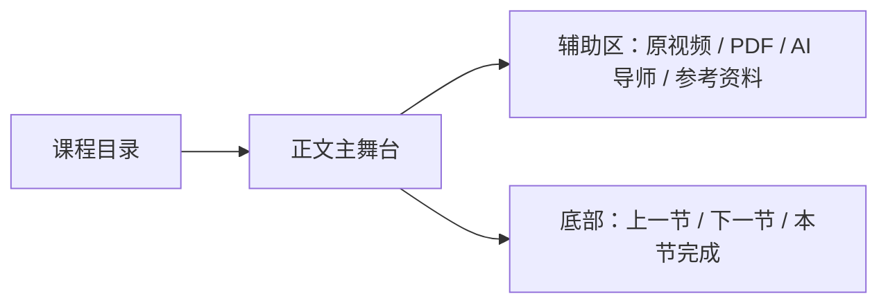
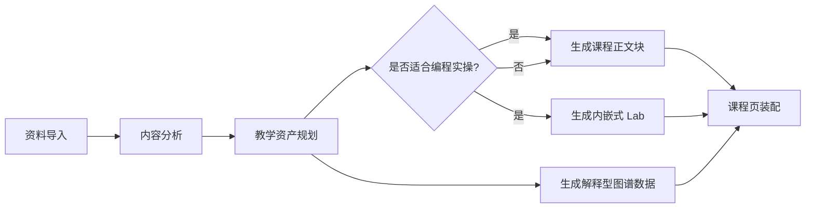

# 课程学习体验重构设计

- 日期：2026-04-19
- 状态：Draft for Review
- 适用范围：Socratiq 第一版课程学习体验重构

## 1. 背景

当前课程页已经打通了“资料导入 -> 内容处理 -> 自动生成课程”的基本链路，但学习体验仍然存在三类明显问题：

1. 课程页仍然偏“功能拼盘”，而不是一条顺滑的学习路径。
2. `Lab` 和 `图谱` 目前更像附属功能，缺少和课程正文的教学协同。
3. 页面壳层继承了后台式导航逻辑，导致 `/learn` 这类沉浸式页面的布局和交互受损。

用户已经明确表达这一版的核心目标不是继续堆功能，而是“让用户更好地学习课程”。因此本次设计不以新增页面数量为成功标准，而以以下问题是否被解决为标准：

- 用户能否更容易进入课程内容本身。
- 用户是否更容易理解概念之间的关系。
- 用户是否只在真正需要时看到练习，而不是被固定 Tab 打断。
- 页面是否比当前版本更沉浸、更稳定、更像课程产品，而不是管理后台。

## 2. 设计目标

本次重构的目标如下：

- 把课程页改造成“课程正文为主舞台，原始资料为辅助”的学习体验。
- 让 `Lab` 从固定页签改为按内容自适应生成的课程资产。
- 让 `图谱` 从单独的展示页改为服务理解和导航的学习组件。
- 隐藏当前无实际后端作用的“学习目标”入口，减少伪控制项。
- 让 `/learn` 脱离全局后台侧边栏，使用专门的学习壳层。

## 3. 非目标

以下内容不属于这一版：

- 重做整套课程生成算法
- 引入新的前端技术栈，例如 JSP
- 做一个完整的课程编辑器
- 做完整的任务中心或课程运营后台
- 解决所有历史翻译问题
- 做个性化学习路径推荐 2.0
- 做多人协作或教师端

说明：

- 截图中暴露的翻译 `500` 是独立 bug，应单独修复，不作为本次体验方案的核心范围。
- 如果现有课程结构化内容不足以支持新 UI，本次只补最必要的结构，不追求一次性完成内容 schema 的终态。

## 4. 设计原则

### 4.1 正文优先

课程正文是主角。视频、PDF、图谱、Lab、导师提示都应服务正文，而不是与正文平级争夺注意力。

### 4.2 学习驱动，而不是功能驱动

页面结构应该围绕“理解 -> 巩固 -> 继续前进”的节奏组织，而不是按技术能力切成多个功能 Tab。

### 4.3 自适应，而不是强迫选择

当前导入时的“学习目标”在前后端并未形成真正闭环。第一版应优先减少假选择，把是否生成 Lab 交给课程生成链路判断。

### 4.4 先稳定路径，再做炫技视觉

图谱、互动卡片、动画都要服务学习，不做“能动但没帮助”的展示型组件。

## 5. 方案决策

本次采用“文档型课程主舞台 + 自适应练习 + 双层图谱”的方案。

与被放弃的两种方案相比：

- 不继续沿用 `学习 / Lab / 图谱` 主 Tab。因为这会持续把一个完整课程拆成三个孤立功能区。
- 不采用“右侧超重控制台”方案。因为长期阅读场景下，持续并列展示视频、图谱、导师、练习会破坏专注。

最终方案的核心是：

- 课程页主视图回到结构化长文档体验。
- `Lab` 只在适合时出现，并出现在合适的章节位置。
- `图谱` 拆成正文内解释卡和课程末尾总览图两层。

## 6. 目标用户体验

用户进入课程后，应该感受到的是一条连续的学习路径：

1. 看见当前节要学什么、为什么重要。
2. 沿着正文逐段理解概念、图示和示例。
3. 在合适的地方被轻量提示做一个练习，而不是被强制切页。
4. 在某个抽象点卡住时，可以通过关系图理解“它依赖什么、又会通向什么”。
5. 在学完当前节后，能够自然继续下一节，而不是回到后台式导航。

## 7. 页面信息架构

### 7.1 顶层结构

`/learn` 不再继承全局 app shell 的后台侧边栏，而使用专用学习壳层。

专用壳层包含：

- 顶部轻量课程栏
- 左侧课程目录栏
- 中央正文主舞台
- 右侧辅助区或可收起抽屉
- 底部章节跳转区

### 7.2 课程页区块

#### 顶部栏

- 返回课程或资料入口
- 课程标题
- 当前节进度，例如 `3 / 12`
- 打开辅助区 / AI 导师按钮

#### 左侧目录栏

- 章节列表
- 当前节高亮
- 已学 / 未学状态
- 移动端下沉为顶部目录抽屉

#### 中央视图

中间区域是唯一默认主舞台，承载整节课程内容。

#### 右侧辅助区

默认可折叠，承载：

- 原视频或原 PDF
- AI 导师
- 参考资料

右侧区不是默认强展示区，而是“需要时再打开”的上下文面板。

### 7.3 响应式策略

- `>= 1280px`：三栏布局
- `768px - 1279px`：左目录可收起，右辅助区默认关闭
- `< 768px`：正文单栏，目录与辅助区使用抽屉或底部面板

这样可以避免当前 IAB 场景下后台侧栏压住学习内容的问题。

## 8. 课程正文设计

### 8.1 从线性渲染切到“教学块渲染”

当前课程正文主要是线性输出：

- 标题
- 文本
- 图
- 代码
- 步骤

这在技术上能渲染，但在学习上缺少节奏。第一版改为“教学块”驱动，允许后端返回一组语义化 block，前端按 block 类型渲染。

建议支持的 block 类型：

- `intro_card`
- `prose`
- `diagram`
- `code_example`
- `concept_relation`
- `practice_trigger`
- `recap`
- `next_step`

### 8.2 推荐正文节奏

每一节按以下节奏组织：

1. 开场导读卡
2. 2-4 个正文块
3. 关键概念关系卡
4. 如适合则插入练习触发卡
5. 小结卡
6. 下一节提示卡

### 8.3 视觉方向

这一版不追求“像后台换皮”，而是强调更像精心排版的课程阅读器：

- 更稳定的阅读宽度
- 更强的标题层级
- 卡片式重点总结和练习入口
- 章节之间有明确节奏，而不是所有元素平铺
- 视频和原资料降级为上下文工具，不抢正文舞台

说明：

- 这里的“样式优化”应继续使用现有 Next.js / React / Tailwind 渲染体系完成。
- 不引入 JSP。正确的方向是“结构化内容 + 更强的 renderer”，而不是更换模板技术。

## 9. Lab 自适应方案

### 9.1 当前问题

当前 `Lab` 有两个根本问题：

1. 它被固定在一个主 Tab 中，脱离正文语境。
2. 它是否生成和用户选择的“学习目标”之间关系并不真实。

现状上，导入页虽然要求用户选学习目标，但前端 API 创建 source 时并没有把 goal 传到后端。这意味着它现在是一个“看起来重要，但并未真正驱动结果”的 UI。

### 9.2 本次决策

第一版直接隐藏导入页的学习目标入口，不再让用户为一个无效参数做选择。

是否生成 `Lab` 改为由课程生成链路中的“教学资产规划”步骤判断。

### 9.3 教学资产规划

在资料内容分析之后、课程生成之前，增加一个轻量决策层，输出课程资产规划结果。

规划层至少判断：

- 这是否属于计算机 / 编程 / 可执行实操类内容
- 是否存在足够稳定的操作步骤、代码片段、算法流程或命令行任务
- 练习是否能形成“有验证标准”的任务

输出结果不需要复杂，只需要支持：

- `lab_mode = inline`
- `lab_mode = none`

第一版不需要保留 `standalone_lab_page`。

### 9.4 用户可见行为

- 如果内容适合编程练习：课程正文在相关章节下出现练习触发卡，进入内嵌或局部展开式 Lab。
- 如果内容不适合：课程中完全不出现 Lab 容器，不展示“此章节无 Lab 练习”这类负反馈文案。

### 9.5 数据边界

`Lab` 在数据模型上仍然是课程资产，但不再是课程顶层导航的一部分。

## 10. 图谱重构方案

### 10.1 当前问题

当前图谱更接近“已经能画出来的力导图”，但并没有很好回答学习者最关心的问题：

- 我现在在学哪个概念
- 这个概念依赖什么
- 接下来会连到哪里
- 为什么这些点之间有关系

### 10.2 双层图谱

本次采用双层图谱，而不是只保留一个全屏图谱页。

#### 第一层：正文内解释型图谱卡

插在章节正文中，服务当前理解。它强调：

- 当前概念
- 前置概念
- 后续可到达概念
- 当前章节在整体路径中的位置

这层图谱优先稳定、可读、解释充分，不追求自由拖拽。

#### 第二层：课程末尾探索型总览图

放在课程末尾或课程总览区，用来帮助用户复盘和自由探索。

这一层可以保留更完整的图结构，但默认仍应以层级化或路径化布局为主，而不是默认随机散开的力导图。

### 10.3 图谱数据需求

后端提供的图谱数据需要从“节点 + 边 + mastery”扩展到更偏教学语义的结构，例如：

- 概念所属章节
- 是否是当前节核心概念
- 前置 / 后续关系类型
- 关系解释文案

第一版即使不能一次补全所有字段，也要至少支持：

- `current`
- `prerequisites`
- `unlocks`
- `section_anchor`

## 11. 生成链路改造

### 11.1 新链路

### 11.2 责任边界

- 内容分析：识别主题、章节、关键概念、素材类型
- 教学资产规划：决定是否生成 Lab、图谱深度、正文块类型
- 课程正文生成：产出 block 化 lesson 内容
- 图谱生成：产出学习导向的概念关系
- 前端 renderer：按 block 和资产配置渲染

## 12. 交互细节

### 12.1 章节切换

- 切节时正文回到顶部
- 目录高亮同步更新
- 右侧辅助区保留打开状态，但内容跟随章节切换

### 12.2 AI 导师

AI 导师保留，但降级为“辅助抽屉”，而不是课程页第一视觉中心。

它的职责是：

- 回答当前节问题
- 解释概念
- 提供额外例子

它不应打断课程主流程。

### 12.3 视频 / 原 PDF

视频和原 PDF 的角色调整为“原始资料参照面板”。

- 默认不占据正文一半宽度
- 当用户需要对照原材料时再展开
- 若当前课程没有视频型资料，则辅助区自动优先显示 PDF 或摘要卡

## 13. 错误处理与降级

### 13.1 Lab

- 若本节没有生成 Lab，不显示空状态噪音
- 若 Lab 数据损坏，显示轻量错误卡，并允许用户继续阅读正文

### 13.2 图谱

- 若解释型图谱数据缺失，正文继续显示，不阻塞阅读
- 若总览图谱加载失败，展示可重试卡片，不影响课程完成

### 13.3 原始资料

- 视频或 PDF 加载失败时，正文仍可完整阅读
- 右侧面板显示“原资料暂时不可用”的非致命提示

## 14. 分阶段落地建议

### Phase 1：课程壳层和结构改造

- `/learn` 退出全局后台侧边栏
- 去掉 `学习 / Lab / 图谱` 主 Tab
- 建立“目录 + 正文 + 辅助区”壳层

### Phase 2：正文 block 化渲染

- 从现有 lesson schema 平滑过渡到 block schema
- 首先实现导读卡、正文块、小结卡、下一步卡

### Phase 3：Lab 自适应

- 隐藏学习目标 UI
- 引入教学资产规划
- 内嵌式练习触发卡上线

### Phase 4：双层图谱

- 正文解释型图谱卡
- 课程末尾总览图

这样可以先把主路径体验做顺，再逐步补强智能资产。

## 15. 验收标准

本次设计落地后，应满足以下标准：

- 学习页在 IAB 和窄屏下不再被全局侧边栏遮挡
- 用户进入课程后，默认看到的是正文主舞台，而不是视频和多功能 Tab 拼盘
- 导入页不再暴露无效的学习目标选择
- 非编程类课程不会再出现无帮助的空 Lab
- 编程类课程可以在合适章节看到练习触发
- 图谱至少能在正文中解释“当前概念与前后概念的关系”
- 视频、PDF、导师、图谱任何一项失败都不会阻塞正文学习

## 16. 对现有代码的直接影响

本设计将直接影响以下模块边界：

- `frontend/src/app/learn/page.tsx`
- `frontend/src/components/lesson/lesson-renderer.tsx`
- `frontend/src/components/knowledge-graph/force-graph.tsx`
- `frontend/src/app/import/page.tsx`
- `frontend/src/lib/api.ts`
- `backend/app/services/course_generator.py`
- `backend/app/services/lesson_generator.py`
- `backend/app/services/lab_generator.py`
- `backend/app/services/knowledge_graph.py`

第一版应尽量沿用现有生成链路和 API 入口，只在必要处补“教学资产规划”和新的 renderer 数据结构。

## 17. 开放约束

为控制这一版范围，明确做以下约束：

- 不在本轮同时重做 dashboard / path / materials 模块
- 不把图谱和 Lab 抽成新的一级导航
- 不为“未来可能支持的所有课型”提前设计过重 schema
- 不引入新的模板引擎

本轮只做一件事：把课程页从“功能集合”提升为“更容易学下去的课程体验”。
